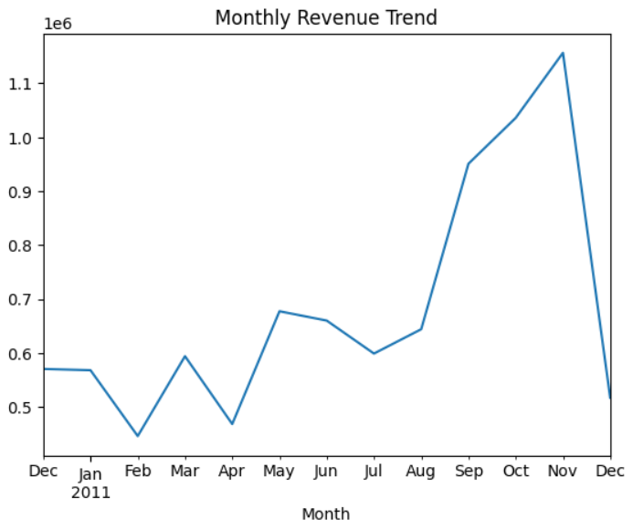
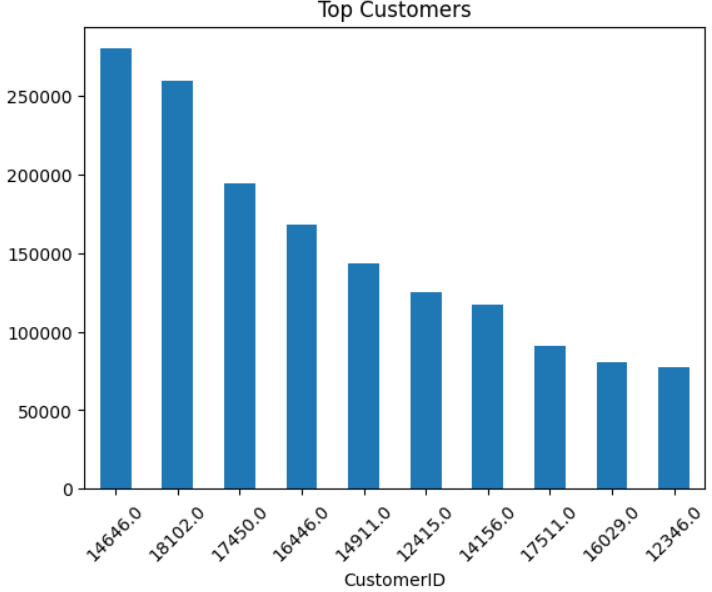

# Customer Purchase Behaviour — Exploratory Data Analysis

**Tools:** Python · pandas · Matplotlib · Seaborn  
**Dataset:** UCI Online Retail Dataset (541K+ transactions, 8 countries)  
**Notebook:** `EDA_customer_analysis.ipynb`

---

## Overview

Retail businesses often lack clarity on which customers, products, and time periods drive the most value. This project analyses a real-world transactional dataset to surface those patterns and translate them into concrete business recommendations.

---

## Key Findings

- **Revenue concentration:** The top 5% of customers account for a disproportionate share of total revenue — a classic Pareto distribution with direct implications for loyalty programme targeting
- **Seasonality:** Sales peak strongly in Q4 (October–December), suggesting inventory and marketing efforts should front-load that period
- **Geographic concentration:** The UK dominates transaction volume, but several EU markets show high average order values worth prioritising
- **Product performance:** A small subset of SKUs drives the majority of units sold; the long tail has high variety but low individual impact

---

## Screenshots


*Monthly revenue over time*




*Revenue concentration among top customers*




---

## Project Workflow

**1. Data cleaning**
- Removed ~25% of rows with missing Customer IDs (guest checkouts)
- Filtered negative quantities (returns/cancellations) for sales-only analysis
- Parsed invoice dates and corrected data types

**2. Feature engineering**
- Created `Revenue` column (`Quantity × UnitPrice`)
- Extracted `Month`, `Hour`, and `DayOfWeek` from invoice timestamps
- Built customer-level aggregates for revenue ranking

**3. Analysis**
- Monthly and hourly sales trends
- Top 10 products by units sold and by revenue
- Top customers by total spend
- Country-level transaction and revenue breakdown
- Revenue distribution across the customer base

---

## Business Recommendations

| Finding | Recommendation |
|---|---|
| Revenue concentrated in top customers | Build a tiered loyalty programme targeting the top 10% |
| Strong Q4 seasonality | Increase stock and ad spend from September |
| High-value EU markets | Expand marketing to Netherlands and Germany |
| Long-tail products with low sales | Consider SKU rationalisation to reduce holding costs |

---

## How to Run
```bash
git clone https://github.com/Amr0024/Exploratory-Data-Analysis-Project.git
cd Exploratory-Data-Analysis-Project
pip install pandas matplotlib seaborn openpyxl
jupyter notebook EDA_customer_analysis.ipynb
```

Dataset: download from [UCI ML Repository](https://archive.ics.uci.edu/ml/datasets/online+retail) and place as `Online Retail.xlsx` in the project folder.

---

## Author

**Amr Nabil** — Computer Science graduate, Data Science & Machine Learning  
[LinkedIn](https://www.linkedin.com/in/amr-nabil-623813220/) · [GitHub](https://github.com/Amr0024)
